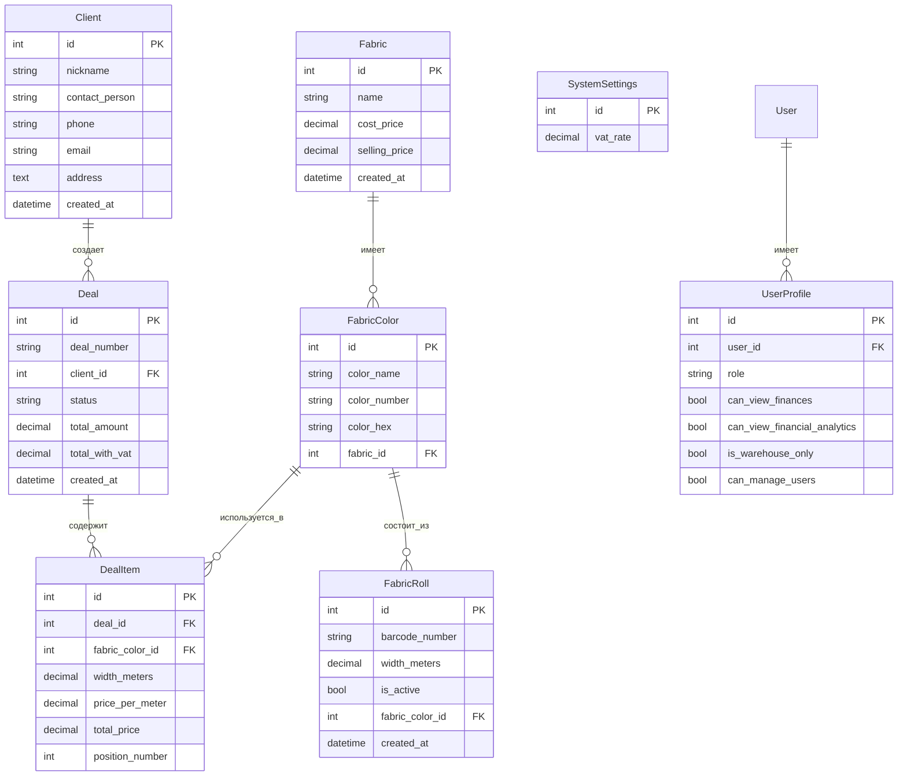

# Руководство разработчика: CRM для тканевого бизнеса

## 1. Общая архитектура
Проект построен на фреймворке Django (Python) с использованием шаблонов Django для фронтенда (HTML, CSS Bootstrap 5, JavaScript). База данных по умолчанию - SQLite, но легко масштабируется на PostgreSQL или MySQL. Проект разделен на несколько Django-приложений, каждое из которых отвечает за свою логическую часть.

```mermaid
graph TD
    A[Пользователь] -->|HTTP/HTTPS| B(Веб-сервер Django)
    B -->|Запросы ORM| C(База данных SQLite/PostgreSQL)
    B -->|Ответы HTML/JSON| A
    B -- Асинхронные запросы --> D[JavaScript (AJAX)]
    D -->|Обновление DOM| A

    subgraph Django Applications
        B1[core] -- Главная страница, базовые URL --> B
        B2[deals] -- Сделки, позиции сделок --> B
        B3[fabrics] -- Ткани, цвета тканей, рулоны --> B
        B4[clients] -- Клиенты --> B
        B5[warehouse] -- Складские операции --> B
        B6[finances] -- Финансы, аналитика, настройки --> B
    end
```

## 2. Структура базы данных и ключевые модели

Проект использует Django ORM. Ниже приведены основные модели и их взаимосвязи.



### Важные связи и логика:
-   `FabricRoll` был перемещен из `warehouse.models` в `fabrics.models` для централизации управления тканями.
-   `Deal.total_profit` - это `@property`, который динамически рассчитывает прибыль сделки на основе цен продажи (`DealItem.total_price`) и себестоимости ткани (`Fabric.cost_price`). **Это не поле БД!** При выборке агрегированных данных по прибыли (например, для топ-клиентов) необходимо итерировать по объектам `Deal` и вызывать этот метод, либо использовать аннотации с `F` выражениями для расчета на уровне БД (если это возможно для комплексных расчетов).
-   Все денежные значения форматируются с использованием пользовательского шаблонного фильтра `format_price` (определен в `deals/templatetags/deal_filters.py`), который использует пробел как разделитель тысяч.
-   Метры форматируются с помощью свойств `@property` в моделях `Fabric` и `FabricColor` (`total_width_meters_formatted`).

## 3. Фронтенд: JavaScript и AJAX
-   Страницы активно используют Vanilla JavaScript для интерактивности (например, добавление позиций в сделку, динамическое обновление финансовых данных).
-   AJAX-запросы (`fetch API`) используются для асинхронного получения и отправки данных на сервер без перезагрузки страницы (например, `/finances/get-period-data/`).
-   Для работы со стилями используется Bootstrap 5. Добавлены пользовательские стили в `<style>` тегах внутри шаблонов для специфических элементов (например, `.btn-action` для кнопок, `.kpi-card` для финансовых карточек).

## 4. Запуск проекта
1.  **Клонировать репозиторий**.
2.  **Создать и активировать виртуальное окружение**:
    ```bash
    python -m venv venv
    # Windows
    .\venv\Scripts\activate
    # macOS/Linux
    source venv/bin/activate
    ```
3.  **Установить зависимости** (из `requirements.txt` - если он существует, или вручную):
    ```bash
    pip install django djangorestframework django-filter Pillow django-crispy-forms crispy_bootstrap5 
    pip install python-barcode Pillow
    pip install qrcode
    pip install reportlab
    pip install rstr
    pip install ripgrep
    ```
    *Примечание: `ripgrep` может потребоваться установить через системный менеджер пакетов или скачать бинарник, если `pip` не работает на вашей ОС.*
4.  **Применить миграции**:
    ```bash
    python manage.py makemigrations
    python manage.py migrate
    ```
5.  **Создать суперпользователя**:
    ```bash
    python manage.py createsuperuser
    ```
6.  **Заполнить тестовыми данными (опционально)**:
    ```bash
    python manage.py seed_data
    ```
7.  **Запустить сервер разработки**:
    ```bash
    python manage.py runserver
    ```

## 5. Важные заметки для будущего разработчика
-   **Миграции**: Будьте внимательны с миграциями, особенно при изменении моделей. Используйте `makemigrations` и `migrate` регулярно. Если возникают конфликты, возможно, придется вручную редактировать файлы миграций или сбрасывать БД для разработки.
-   **Обработка `None`**: Часто проверяйте значения, которые могут быть `None` (например, `get` из словаря, или результаты запросов `.first()`), чтобы избежать ошибок.
-   **Финансовая логика**: Расчет прибыли и других финансовых показателей сложен. Всегда проверяйте, что формулы соответствуют бизнес-логике заказчика, особенно при работе с себестоимостью и НДС.
-   **Тестирование**: Рекомендуется добавлять юнит-тесты и интеграционные тесты для новой функциональности, особенно для критически важных финансовых расчетов и складских операций.

--- 